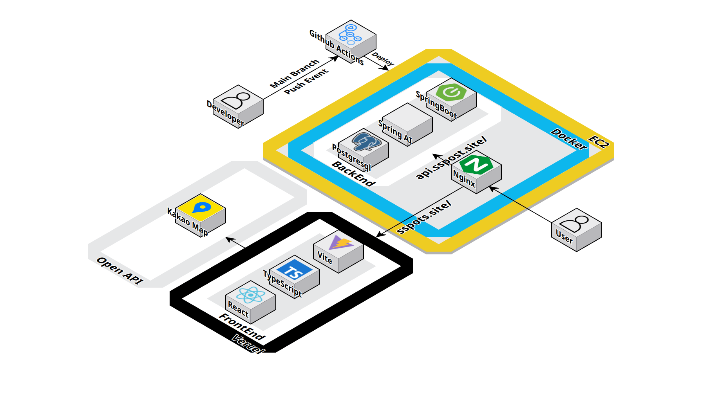

# FitFinder - 나에게 딱 맞는 운동 프로그램과 AI 주간 루틴을 제공하는 웹서비스

## 1. 서비스 소개 (공모전 3등 수상작 🏆)

FitFinder는 국민체육진흥공단(KSPO)의 공공 체육·생활 스포츠 데이터를 기반으로,
사용자의 성별, 연령, 위치, 관심 종목, 운동 가능 시간대를 반영해 가장 적합한 운동 프로그램을 추천해 주는 맞춤형 서비스입니다.

사용자는 복잡하게 검색할 필요 없이, 자신의 생활 패턴에 맞는 근처 운동 프로그램과 시설을 쉽게 확인할 수 있습니다. 더 나아가 FitFinder는 개인 조건과 주변 환경을 함께 고려해 일주일 운동 루틴까지 자동으로 구성해 주어,
운동 계획 세우는 부담을 덜어줍니다.

FitFinder는 공공 데이터를 활용해 누구나 자연스럽게 운동을 시작하고 꾸준히 유지할 수 있는 환경을 만드는 것을 목표로 합니다.

## 2. 팀원 구성

<div align = "center">

|                                                              **김용범**                                                               |                                                              **소태호**                                                               |                                                                **나윤빈**                                                                |                                                              **박심인**                                                              |
|:----------------------------------------------------------------------------------------------------------------------------------:|:----------------------------------------------------------------------------------------------------------------------------------:|:-------------------------------------------------------------------------------------------------------------------------------------:|:---------------------------------------------------------------------------------------------------------------------------------:|
| [ <br/> @Bumnote](https://github.com/Bumnote) | [ <br/> @SoTaeHo](https://github.com/SoTaeHo) | [ <br/> @skdbsqls](https://github.com/skdbsqls) | [ <br/> @IMCTZN](https://github.com/IMCTZN) |
|                                                            Backend, AI                                                             |                                                                 AI                                                                 |                                                               Frontend                                                                |                                                               Data                                                                |

</div>

## 3. 개발 환경

### Backend

| 항목         | 버전/설정                                      |
  |------------|--------------------------------------------|
| Framework  | Spring Boot 3.5.8                          |
| JDK        | Temurin 21                                 |
| AI         | Spring AI 1.1.0                            |
| Build Tool | Gradle 9.2.1                               |
| Database   | PostgreSQL 15 + PostGIS                    |
| ORM        | Hibernate 6.6 + Hibernate Spatial          |
| 기타         | Docker 24+, Docker Compose, GitHub Actions |

### 실행 프로필

- `local`: 로컬 개발용, `.env`와 `application-secret.yml`을 통해 DB/OpenAI 키 주입
- `prod`: Docker Compose 및 EC2 배포에서 사용, `.env`와 Secrets로 환경 분리

### Frontend

| 항목         | 버전/설정                     |
|------------|---------------------------|
| Framework  | React 19.2.0              |
| Language   | TypeScript 5.9.3          |
| Build Tool | Vite 7.2.4                |
| Router     | React Router DOM 7.9.6    |
| Styling    | Tailwind CSS 4.1.17       |
| State      | Zustand 5.0.9             |
| HTTP       | Axios 1.13.2              |
| Icons      | Lucide React 0.555.0      |
| 기타         | html-to-image 1.11.13     |
| Deployment | Vercel                    |


## 4. 아키텍처 구조


## 5. 채택한 개발 기술

### Backend

- **Spring Web + Validation**: REST API, DTO 검증
- **Spring Data JPA + QueryDSL 6.12**: 동적 조건 검색(`ProgramRepositoryImpl`)과 Slice + 커서 기반 무한 스크롤 페이징
- **PostGIS + Hibernate Spatial**: `geography(Point, 4326)` 타입과 `ST_DWithin`, `ST_Distance`를 활용한 공간 인덱스(GiST) 기반 반경 검색
- **Spring AI 1.1.0**: `ChatClient`로 OpenAI Chat Completions 호출, Prompt 활용한 JSON 응답 파싱
- **Swagger(springdoc-openapi 2.8.6)**: 서비스 로직의 오염을 없애기 위한 Swagger 전용 인터페이스를 만들어 API 명세 자동화
- **Global Exception Handling**: `GlobalExceptionHandler`를 통한 `CustomException` 커스텀 예외 및 `ApiResponse` 공통 응답
- **Docker & Docker Compose**: `spots-app`, `postgres`, `nginx`, `certbot` 스택 운영
- **CI/CD**: GitHub Actions `CI.yml` 빌드 & 도커 푸시, `CD.yml` EC2 자동 배포
- **Infra Scripts**: `scripts/deploy.sh`로 SSL 발급/갱신 + 서비스 롤링

### Frontend

- **React 19.2.0**: 최신 React를 활용한 컴포넌트 기반 UI 개발
- **TypeScript**: 타입 안정성을 통한 코드 품질 향상 및 개발 생산성 증대
- **Vite**: 빠른 개발 서버 및 최적화된 프로덕션 빌드
- **React Router DOM**: SPA 라우팅 및 페이지 전환 관리
- **Tailwind CSS v4**: 유틸리티 기반 스타일링으로 일관된 디자인 시스템 구축
- **Zustand**: 가볍고 직관적인 전역 상태 관리
- **Axios**: RESTful API 통신
- **Kakao Maps API**: 지도 표시 및 위치 기반 서비스
- **html-to-image**: AI 루틴 결과를 이미지로 내보내기
- **Lucide React**: 일관된 아이콘 시스템
- **Vercel**: 자동 배포 및 CDN 최적화

## 6. 프로젝트 구조

### Backend

```
spots/
├── build.gradle / settings.gradle
├── docker-compose.yml          # app + db + nginx + certbot
├── Dockerfile / Dockerfile.local
├── scripts/deploy.sh
├── nginx/
│   ├── nginx-prod.conf         # 운영 reverse proxy
│   └── nginx-cert-setup.conf   # Certbot 임시 설정
├── src/
│   └── main/
│       ├── java/com/spots/
│       │   ├── SpotsApplication.java
│       │   ├── domain/
│       │   │   ├── program/    # controller/service/repository/entity/dto
│       │   │   ├── facility/
│       │   │   ├── transport/
│       │   │   ├── ai/
│       │   │   └── category/
│       │   ├── global/         # config, exception, swagger
│       │   └── swagger/
│       └── resources/
│           ├── application*.yml
│           └── prompt/routine.prompt
└── .github/workflows/CI.yml, CD.yml
```

### Frontend

```
frontend/
├── public/
│   ├── favicon.svg
│   └── thumbnail.png
├── src/
│   ├── assets/              # 이미지 리소스
│   │   ├── female.png
│   │   ├── male.png
│   │   ├── loading.png
│   │   └── ...
│   ├── components/          # 재사용 가능한 컴포넌트
│   │   ├── Button.tsx
│   │   ├── Header.tsx
│   │   ├── ProgressBar.tsx
│   │   ├── DayFilterModal.tsx
│   │   ├── TimeFilterModal.tsx
│   │   ├── ProgramDetailModal.tsx
│   │   ├── AIRoutineModal.tsx
│   │   └── RoutineImageExport.tsx
│   ├── pages/               # 페이지 컴포넌트
│   │   ├── HomePage.tsx
│   │   ├── ProgramListPage.tsx
│   │   └── survey/
│   │       ├── SurveyStep1.tsx  # 성별 선택
│   │       ├── SurveyStep2.tsx  # 연령대 선택
│   │       ├── SurveyStep3.tsx  # 위치 선택 (Kakao Map)
│   │       └── SurveyStep4.tsx  # 선호 종목 선택
│   ├── routes/              # 라우팅 설정
│   │   └── index.tsx
│   ├── services/            # API 서비스
│   │   └── api.ts
│   ├── store/               # 상태 관리 (Zustand)
│   │   └── surveyStore.ts
│   ├── types/               # 타입 정의
│   │   └── kakao.d.ts
│   ├── App.tsx
│   ├── main.tsx
│   └── index.css
├── index.html
├── package.json
├── tsconfig.json
├── vite.config.ts
├── tailwind.config.ts
└── vercel.json
```

## 7. 개발한 기능 설명

### Backend

1. **프로그램 조건 검색 API (`ProgramController#searchPrograms`)**
    - 입력: 성별, 연령, 좌표, 선호 종목, 요일, 시간, 페이지 파라미터.
    - QueryDSL에서 PostGIS `ST_DWithin` 기반 반경 필터 + 카테고리/요일/시간 동적 조건을 조합해 Slice 응답을 반환합니다.
2. **PostGIS 공간 쿼리 도입**
    - 기존 하버사인 공식(Seq Scan) 대신 `geography(Point, 4326)` 타입 + GiST 공간 인덱스를 적용했습니다.
    - `ST_DWithin`으로 인덱스 기반 반경 검색, `ST_Distance`로 거리 계산을 수행합니다.
    - Hibernate 6.x HQL 파서가 `ST_DWithin`을 인식하지 못하는 문제를 `function()` 키워드와 JTS Point 객체 전달 방식으로 해결했습니다.
3. **추천 서비스 쿼리 최적화 (3N+2 → 3)**
    - 기존: 루프 안에서 `getProgram()` 개별 호출 → Program/Facility/Transit 각각 N회 조회 (3N+2회)
    - 개선: `findAllWithFacility()` + `findTop2TransitByFacilityIds()` 배치 조회 후 Map으로 메모리 조합 (3회)
    - 이미 계산된 distance를 재활용하여 Java 레벨 하버사인 중복 계산을 제거했습니다.
4. **프로그램 상세 조회 (`ProgramService#getProgram`)**
    - Program + Facility + Transit 데이터를 집계해 이름, 대상, 요일, 가격, 예약 URL, 시설 주소, 대중교통 TOP2를 제공합니다.
5. **시설/교통 데이터 처리**
    - `Facility`, `FacilityTransit` 엔티티 및 `TransitRepository` Native Query로 랭크 기준 상위 2개 이동 수단을 도보 분 단위로 계산합니다.
    - 배치 조회(`findTop2TransitByFacilityIds`)를 통해 IN절 한 번으로 전체 시설의 교통 데이터를 조회합니다.
6. **AI 기반 주간 루틴 생성 (`RecommendService`, `RecommendLLMService`)**
    - Program 검색 결과를 LLM 프롬프트(`routine.prompt`)에 삽입, OpenAI 응답을 `WeeklyRecommendResponse`로 역직렬화합니다.
7. **글로벌 예외/검증 체계**
    - `@Valid` DTO + `GlobalExceptionHandler` → `ApiResponse` 포맷으로 에러 메시지 일관성 유지, Swagger 예시 자동화를 통해 API 문서 신뢰성 확보합니다.
8. **운영 자동화**
    - GitHub Actions CI에서 Gradle clean build 및 Docker Hub Push를 수행합니다.
    - CD 워크플로우가 EC2로 `deploy.sh`와 설정을 전달해 Docker Compose 재기동, Certbot 자동 갱신 및 Nginx 재로드까지 수행합니다.

### Frontend

1. **4단계 설문조사 시스템**
    - **Step 1**: 성별 선택 (남성/여성)
    - **Step 2**: 연령대 선택 (영유아/초등학생/중학생/고등학생/성인/시니어)
    - **Step 3**: 위치 선택 - Kakao Maps API를 활용한 실시간 위치 입력
    - **Step 4**: 선호 종목 선택 - 8개 대분류, 56개 소분류 중 다중 선택
    - Zustand 기반 상태 관리로 설문 응답 데이터 저장 및 관리

2. **프로그램 목록 및 필터링 (`ProgramListPage`)**
    - 설문 결과 기반 맞춤 프로그램 목록 표시
    - 무한 스크롤 (Intersection Observer) - `lastProgramId`, `lastDistance` 기반 커서 페이지네이션
    - 실시간 필터: 요일별, 시간대별 프로그램 필터링
    - 거리 기반 정렬: 사용자 위치에서 가까운 시설부터 표시
    - 프로그램 카드 클릭 시 상세 정보 모달 표시

3. **프로그램 상세 모달 (`ProgramDetailModal`)**
    - 프로그램 이름, 대상 연령, 요일, 시간, 가격
    - 시설명, 주소, Kakao Maps 지도 표시
    - 대중교통 정보 (지하철/버스 TOP 2, 도보 시간)
    - Kakao Map 길찾기
    - 예약 URL 링크

4. **AI 운동 루틴 생성 (`AIRoutineModal`)**
    - 키, 몸무게 입력 → Backend AI 추천 API 호출
    - 7일간의 맞춤 운동 계획 생성
    - 운동 종류, 시간, 장소, 거리, 태그 정보 표시
    - html-to-image를 활용한 루틴 이미지 내보내기 기능

5. **반응형 디자인 및 UX**
    - Tailwind CSS 기반 모바일/태블릿/데스크톱 최적화
    - 다크 모드 테마
    - 로딩 상태 애니메이션
    - 부드러운 페이지 전환 효과

6. **API 통신 (`services/api.ts`)**
    - Axios 인스턴스 기반 중앙화된 API 통신
    - TypeScript 인터페이스로 요청/응답 타입 정의
    - `fetchPrograms`: 프로그램 목록 조회 (무한 스크롤 지원)
    - `fetchProgramDetail`: 프로그램 상세 조회
    - `generateAIRoutine`: AI 운동 루틴 생성

## 8. 활용한 데이터 출처

- 문화 빅데이터
  플랫폼: [공공체육시설 프로그램 정보](https://www.bigdata-culture.kr/bigdata/user/data_market/detail.do?id=c3b8fb69-307d-4ae7-ab42-d0314c89ef47)
